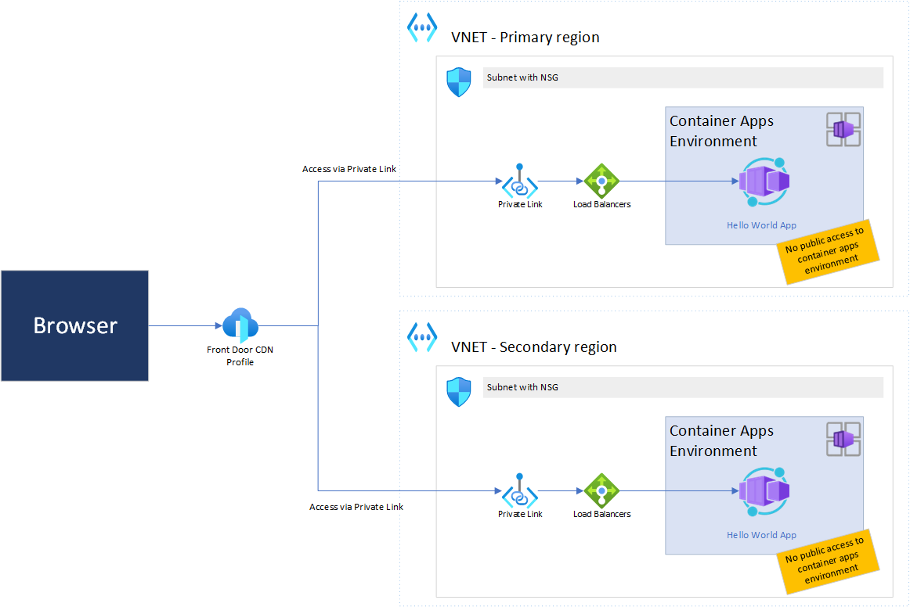
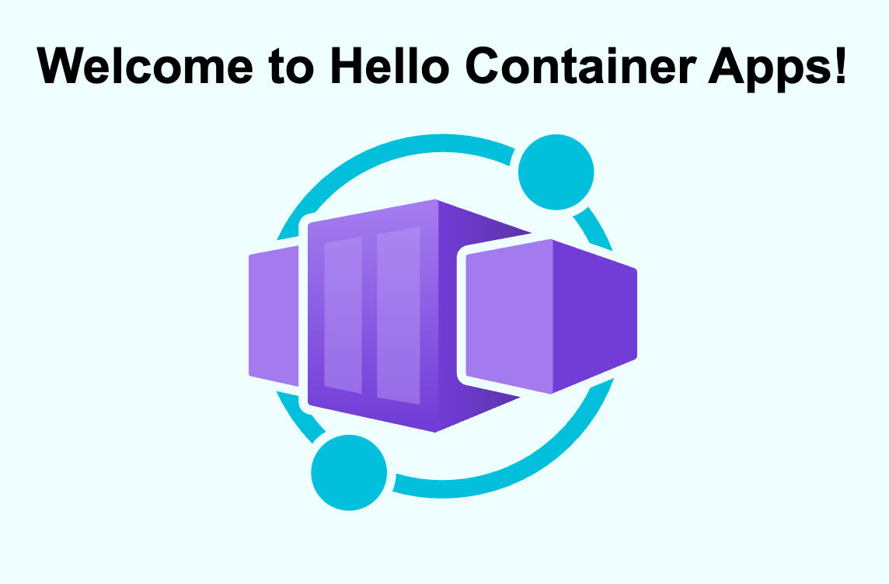

# Azure FrontDoor & Azure Container Apps

## Overview
This repository demonstrates how to use Azure Container Apps with private VNET integration together with Azure FrontDoor. This follows the best practise to enable only VNET internal incoming traffic to Azure Container Apps.

## Architecture


## Implementation
This project contains two main packages.

### App
The example app is a nodeJS application, that consists of an index.html (/) and an health endpoint (/health). The app is already pre-built and publicly available on Docker Hub.

### Infrastructure
This repo leverages Bicep as Infrastructure as Code. Beside the provisioning of the resource group and approving of the created private link connection everything is deployed by Bicep code.
Entrypoint for the deployment is deploy.sh. It is crucial to define the basename in the deploy.sh before running it. This base name is used as a prefix for all resources, including the resource group.

## Setup / How To
### Prerequisites
1. Azure Subscription
2. Azure CLI installed locally, Azure Cloud Shell or GitHub Codespaces (or alternatives)
3. Bash shell to execute deploy.sh

### Deployment
1. App is already built and available on Docker Hub. Feel free to re-built and host by yourself. (/app)
2. Infrastructure code is in /infra

```
# Update Base_Name to an individual value in /infra/deploy.sh. 
## (Optional: Update location)

cd infra

az login
az upgrade 
./deploy.sh
```
3. After 10-15 Minutes everything should be deployed and the FrontDoor Endpoint is reachable. The "Hello Container App"-application is available.


## Result
After the deployment a basic Azure Container App application is available via Azure FrontDoor FQDN.


## Limitations / Improvements
- Private Link Service Auto Approval is not possible because the FrontDoor service is located in a Microsoft owned subscription. For that reason this project tries to approve the endpoint semi-automatic. In some scenarios this might fail and you need to approve the request manually in the created Private Link Service after the deployment.
- Documentation needs improvement
- GitHub Actions integration missing
- (Optional) Include Custom Domains

# Disclaimer
This is only sample code and not production ready!